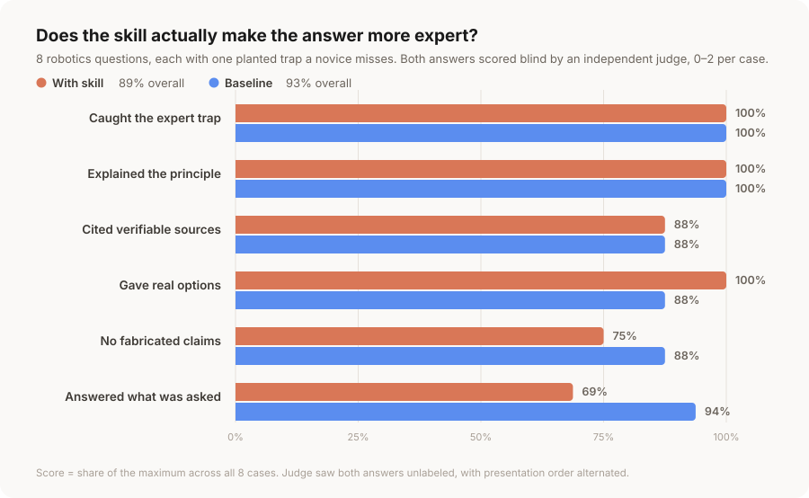

# Evaluation

Everything here is the measured result. The skills lose most of it.

## Headline

Across **14 blind-judged robotics questions**, an unaided strong model beat the skill-guided answers on 10, the skills won 3, and 1 tied. Two question shapes were tested and the skills lost both.



The split is consistent enough to state as a finding: **the skills win on what the answer contains and lose on what the answer does.**

| Criterion | With skill | Baseline |
|---|---|---|
| Delivered the expert value | **100%** | 96% |
| Explained the principle | **100%** | 96% |
| Gave real options | **100%** | 96% |
| Cited verifiable sources | 89% | 89% |
| No fabricated claims | 75% | **89%** |
| Answered what was asked | 61% | **96%** |

## Method

Two benchmarks, same six-criteria rubric, same blind protocol.

**Diagnostic shape** (8 cases) — "why is this happening / how do I fix it", each with one **planted trap**: a root cause an expert catches and a plausible answer misses. Example: "12-DOF quadruped on hobby RC servos, MPC or RL for trotting?" The correct answer refuses the framing, because position-only high-reduction servos cannot do dynamic locomotion at all. *Result: skill 2, baseline 5, 1 tie.*

**Design shape** (6 cases) — "we're building X, how should we approach it", where a decision sequence is the right answer shape and the graded value is imposing an order on the decisions. This was added specifically because the diagnostic set tested the wrong mode for a decision-advisor tool. *Result: skill 1, baseline 5.*

Each question was answered twice — once by an agent following the relevant skill, once by the same model unaided. An independent judge scored both **without being told which was which**, with presentation order alternated across cases to cancel position bias. Every case directory keeps both answers and the judge's `grade.json`, so the scoring can be re-read rather than taken on trust.

## Why the skills lose

Judges repeatedly said the skill-guided answers were the deeper ones — "nails the dependency chain explicitly", "the two items most answers miss", "deeper physics", "the only answer with real citations". They lost anyway, on two things.

**They deliver the process instead of the answer.** On one design case the skill-guided answer "defers 6 of 7 decisions and spends a third of the page on workflow meta." On a diagnostic case it "burns a full section on an unrequested A/B/C/D consulting intake menu." An advisor that hands back a framework instead of a recommendation has delivered nothing, and scope scored 61% against the baseline's 96%.

**They reach for specifics they cannot stand behind.** Stale list prices, a platform mass that does not match the vendor, arXiv IDs reconstructed rather than looked up. The baseline says vaguer things and so has less to be wrong about — 89% vs 75% on fabrication.

## What was tried

Four rounds of fixes, each measured:

1. **Gated the loop-mode menu** to multi-decision work instead of every answer. Scope 56% → 69%.
2. **Hedged unverifiable snapshot facts.** Fabrication 69% → 75% — but the skills responded by dropping standard *numbers* ("the national robot safety standard"), costing source quality 100% → 88%. The rule now hedges a claim's currency while keeping its identity.
3. **Added an answer-shape rule** — diagnose diagnostics, sequence design questions. No measurable effect: one section cannot outweigh a document whose whole gravity is the decision sequence.
4. **Made the snapshot the citation boundary**, and added *deliver before you defer* and *vendor numbers are quotes, not facts*. Not yet measured — the honest state is that these address the two failure modes above but have not been proven to fix them.

The lesson from round 3 is the load-bearing one: this is a structural property of a decision-loop tool, not a wording bug.

## Limitations

- **Live search was unavailable in every run.** That disables the mechanism these skills are built around, so this measures the snapshots alone.
- **Single-turn evaluation penalizes an interactive design.** The skills stop at decision gates because a real user would answer them; a judge reading one page scores that as work not done. Some of the 61% scope gap is this artifact, not a defect — but the mode menus and assumption tables are noise either way.
- One run per condition; no variance estimate. The judge is a language model applying a rubric, not a practicing roboticist.

## An earlier number, retracted

An earlier iteration reported **100% vs 83.8%** in favor of the skills. Do not trust it: the assertions were written by the same author as the skills and rewarded the skills' own output format — present options, cite the textbook, stop at a gate — rather than answer quality. The blind rubric replaced it and reached the opposite conclusion. It is recorded here only so nobody re-quotes it.

## What this means for using the collection

Take the honest version: for a robotics question you could just ask, **asking directly is fine, and often better.** The measured value of this collection is narrower than "better answers":

- **The verified snapshots.** `references/landscape.md` records things a model's memory gets wrong — that `osrf/rmf_core` was archived in 2021 and Open-RMF moved, which ISO revision is actually in force, which repo is dead. That part is checkable: `scripts/check_sources.py` re-validates every source URL.
- **The decision order** for multi-day build work, where knowing what must be settled first is the whole game.

Neither of those is what a one-shot answer benchmark measures.

## Reproducing

```sh
python3 scripts/make_bench_chart.py <workspace> [<workspace> ...]
```

## A fairer test would need

Live search enabled, multi-turn scenarios where gates actually get answered, questions whose answers turned over recently enough that a stale one is detectably wrong, and a human robotics reviewer alongside the model judge.
