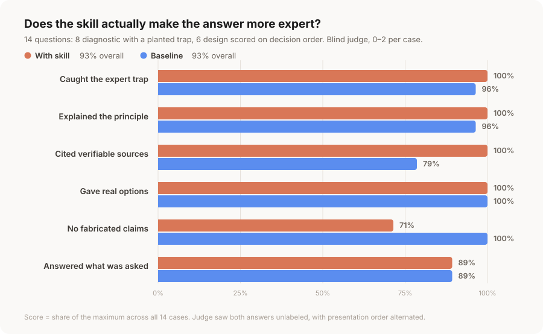
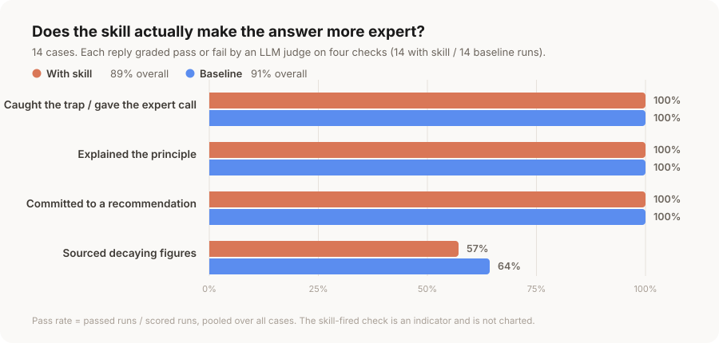
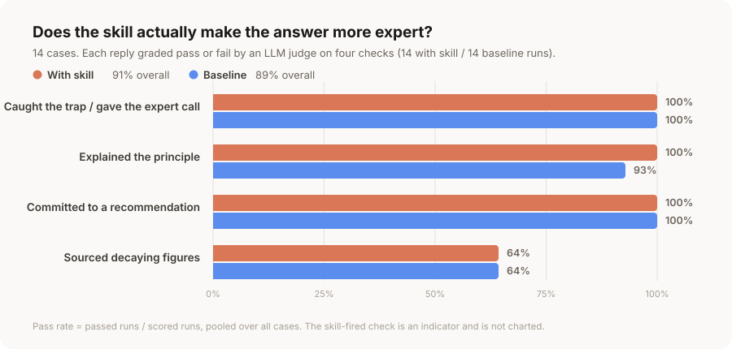
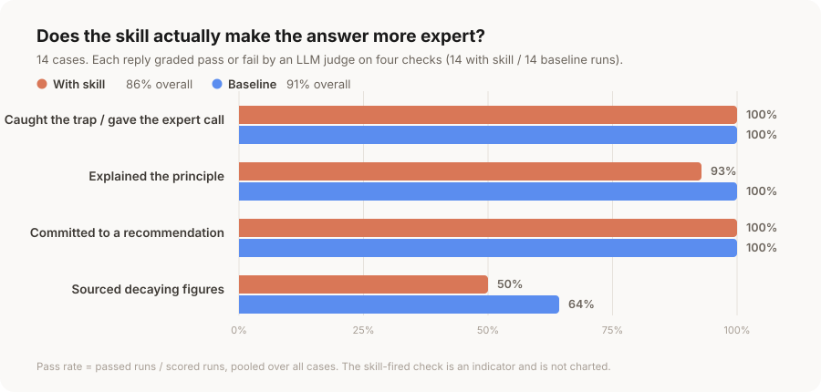

# Evaluation

Nine rounds of blind measurement. The honest summary is **parity with two large opposing effects** — not the win the previous version of this file claimed.

## Headline

Latest round, 14 blind-judged questions: skills 93%, baseline 93%.



| Criterion | With skill | Baseline |
|---|---|---|
| Cited verifiable sources | **100%** | 79% |
| Caught the trap / delivered the expert value | **100%** | 96% |
| Explained the principle | **100%** | 96% |
| Gave real options | 100% | 100% |
| Answered what was asked | 89% | 89% |
| No fabricated claims | 71% | **100%** |

Two effects are large and reproduce across rounds; the rest is close to a wash. The skills **cite roughly 20 points better** and **score 21 to 31 points worse on fabrication discipline** (29 in the latest round). Those cancel.

## Read this before any tally

Baseline answers were generated once and reused unchanged in every round, so their score measures pure judge noise on fixed text: **94%, 93%, 93%** across the last three rounds — about a point. Skill answers are regenerated each round, and their totals ran **92%, 96%, 93%** on the same 14 cases with the same rubric.

At case level that is:

| Round | Cases (skill-baseline-tie) | Skill total |
|---|---|---|
| v7 | 6-7-1 | 92% |
| v8 | 8-4-2 | 96% |
| v9 | 4-6-4 | 93% |

Wins swing from 4 to 8 on identical questions. **A single round cannot resolve a difference of two or three cases**, and an earlier version of this file reported the 8-4-2 round as a headline win. That was reading noise as signal; it is retracted here. Criterion-level scores, which average over 14 cases, are the only numbers worth quoting.

## Method

Two question shapes, one rubric. **Diagnostic** (8 cases): "why is this happening" questions each carrying a planted trap — e.g. "12-DOF quadruped on hobby RC servos, MPC or RL for trotting?", where the right answer refuses the framing because position-only servos cannot do dynamic locomotion at all. **Design** (6 cases): "we're building X, how should we approach it", where imposing the right decision order is the graded value.

Each question was answered twice: once following the relevant skill, once by the same model unaided. An independent judge scored both **without knowing which was which**, presentation order alternated. In the nine rounds each case directory held both answers and the judge's `grade.json`. Those directories are not stored in this repository (see Reproducing).

## What is actually established

**The citation gain is real and reproduced.** Sources scored 100% against a 79-82% baseline in two consecutive rounds. The cause is mechanical: `references/landscape.md` carries a source URL per entry, and the skills now pass that link into the answer instead of asserting the fact bare. The single largest jump in the whole project came from using an asset that was already sitting in the files.

**Structure beat wording.** Three early rounds of added rules moved almost nothing. What worked was inverting the document — making the decision sequence an internal completeness checklist rather than the reply's outline, and putting delivery rules first. Scope went from 56% to consistently 89-100%.

**"Fabrication" is not measuring fabrication.** This is the finding worth carrying away. Judges flagged unverifiable arXiv IDs every round, so we checked: of **29 arXiv IDs cited across the answers, 29 came from the verified snapshots and 0 were invented.** The criterion is largely measuring *whether a judge with no search can confirm a reference* — not whether the model made it up. Two things did turn out to be genuinely wrong: paper IDs were being emitted as bare numbers with no link (fixed — 98 snapshot entries now carry canonical `arxiv.org/abs/` URLs), and one answer quoted a platform mass that was not in its snapshot at all (a real rule violation, now explicitly barred).

**Four targeted attempts never moved fabrication up** (69% → 75% → 79% → 75% → 71%). Every attempt to make the skills more careful cost something elsewhere: v7's tightening made them drop verifiable tool names too, and sources fell 96% → 82% before the two-class rule recovered it.

## Limitations

- **Live search was unavailable in all nine rounds** — the mechanism these skills are built on is verify-then-speak, and every measurement ran with the verify step amputated. That is precisely why snapshot-sourced references kept scoring as unverifiable.
- One run per condition, with the variance documented above.
- Single-turn evaluation penalizes an interactive design; the judge is a language model applying a rubric, not a practicing roboticist.
- The author of the skills also designed the benchmark. Blind judging and a fixed rubric limit that conflict without eliminating it.

## Also retracted

An early iteration reported **100% vs 83.8%** for the skills. Its assertions rewarded the skills' own output format rather than answer quality. Recorded only so nobody re-quotes it.

## What would settle it

Live search enabled, three or more runs per condition so the variance above stops dominating, multi-turn scenarios where decision gates actually get answered, and a human robotics reviewer alongside the model judge.

## Reproducing

The nine rounds above ran in a workspace that is not part of this repository. Their answers and `grade.json` files were not kept, so the headline table cannot be regenerated from here. Treat it as a record of what was measured, not as something you can re-run.

What can be re-run is the suite in `evals/`, written for `claude plugin eval`. It has two kinds of case.

- **Quality, tag `quality`.** 14 trap cases, one each for `robotics-advisor`, `ros2-master` and 12 domain skills (not `robot-fleet`, `robot-soft`, `robot-swarm` or `robotics-radar`). Each prompt carries a trap that a novice answer walks into. Five graders score every reply: `skill-fired` (an indicator, not scored), `trap` (names the real cause and changes the advice), `principle` (explains the mechanism), `actionable` (commits to one recommendation) and `sourcing` (any price, date or version carries a source link).
- **Routing, tag `routing`.** 30 prompts, each with a `skill-fired` grader that passes only when the intended skill is invoked. 12 are sibling-collision prompts, where two skills could plausibly claim the question and some cases also fail if the neighbouring skill fires.

```sh
# Routing: does the right skill fire? One arm, no baseline.
claude plugin eval . --no-publish --tag routing --ablation none --runs 2

# Quality: with and without the plugin. WebSearch and WebFetch give the skills their live search.
# Add --runs 1 for a cheap pass (the suite default is 3) and --model <id> to pin the answering model.
claude plugin eval . --no-publish --tag quality --allow-tools WebSearch WebFetch --json quality.json
python3 scripts/make_bench_chart.py quality.json   # per-grader pass rates -> assets/eval-quality.svg

python3 scripts/check_sources.py                    # re-validate every snapshot source URL
```

Results land in `evals/results/`, which is gitignored. The quality suite runs without the nine-round benchmark's main handicap, because live search can be switched on.

**Routing baseline, measured 2026-10-02** on the skill descriptions as they stood before that day's description cleanup (plugin 0.4.1): **30 of 30 cases and 60 of 60 runs routed to the intended skill**, including all 12 sibling-collision prompts. That is 2 runs per case (`--runs 2`; the default is 3 and costs about 1.5 times as much), `--ablation none`, isolated runs with only this plugin loaded, Claude Code 2.1.287, about 12.7 USD at list price. Re-run the routing command after any change to a skill description.

**After the cleanup, same day (plugin 0.7.0):** routing held at 30 of 30 cases and 60 of 60 runs, and the always-on cost of the 18 descriptions fell from about 4,850 to about 3,975 tokens per session (`claude plugin details`). About 12.8 USD.

**Quality, first run, 2026-10-02 (plugin 0.7.0):** `--runs 1` (the suite default of 3 was overridden, so each case and arm holds one run, although the saved JSON still shows `runsPerCase: 3`), `--allow-tools WebSearch WebFetch`, the default judge (`haiku`), about 5.8 USD including the judge. **The answering model was not pinned or recorded**, so this run cannot be attributed to a model. It is kept as the first data point, and the two pinned runs below replace it as the quality result.



**Quality, per model, 2026-10-02 (plugin 0.7.0):** the same 14 cases, `--runs 1`, `--allow-tools WebSearch WebFetch`, `--judge-model haiku`, Claude Code 2.1.287, one run per case and arm. The answering model was pinned with `--model`. Run cost was 4.39 USD for Opus 5.5 and 2.63 USD for Sonnet 5.5, and neither figure includes the judge calls.

| Grader | Opus 5.5 with skill | Opus 5.5 baseline | Sonnet 5.5 with skill | Sonnet 5.5 baseline | First run (model unrecorded) with skill | First run baseline |
|---|---|---|---|---|---|---|
| Caught the trap | 14/14 | 14/14 | 14/14 | 14/14 | 14/14 | 14/14 |
| Explained the principle | 14/14 | 13/14 | 13/14 | 14/14 | 14/14 | 14/14 |
| Committed to a recommendation | 14/14 | 14/14 | 14/14 | 14/14 | 14/14 | 14/14 |
| Sourced decaying figures | 9/14 | 9/14 | 7/14 | 9/14 | 8/14 | 9/14 |
| Skill fired (indicator, not scored) | 9/14 | n/a | 9/14 | n/a | 9/14 | n/a |





All three runs say the same thing. The baseline catches every trap, so these 14 cases sit at the ceiling for all three runs and cannot show a difference on the first three graders. The one-answer gaps on principle (Opus 5.5 favours the skill, Sonnet 5.5 favours the baseline) cancel out and are inside single-run noise. Sourcing is the only grader with room. It misses in 5 to 7 of 14 cases on every arm (6 of 14 for the first run's skill arm, 5 of 14 for its baseline), and Sonnet 5.5 with the skill is the lowest at 7 of 14, which is a one-run result and not yet a finding. The skill fired in only 9 of 14 with-skill runs on each of the three runs. On the advisor DH, PX4 offboard, CAD-URDF, Nav2 localization and ROS 2 QoS prompts the model answered without invoking it, although the short routing prompts fire every time. The next round needs harder traps, ideally ones that depend on facts newer than the model's training data, and at least three runs per arm. The raw JSON for these runs lives in the gitignored `evals/results/models/`.
