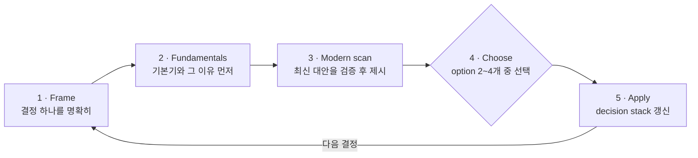

<div align="center">

# 🤖 claude-robotics-skills

**Fundamentals first. Modern options verified. You choose — then loop.**

Claude Code용 robotics 의사결정 skill 모음입니다.

[](LICENSE)
[](https://github.com/joey114132/claude-robotics-skills)
[](#-skills)

</div>

---

## ✨ Skills

| | Skill | 역할 |
|---|-------|------|
| 🧠 | [`robotics-advisor`](skills/robotics-advisor/SKILL.md) | 로봇 문제를 kinematics·dynamics·control **기본기**부터 정리하고, web/arXiv에서 검증한 최신 기법을 나란히 option으로 제시합니다. |
| 🛰️ | [`ros2-master`](skills/ros2-master/SKILL.md) | ROS 2 architect — topic/service/action, lifecycle node, QoS, executor, ros2_control 같은 설계 결정을 함께 내립니다. |
| 🦾 | [`robot-arm`](skills/robot-arm/SKILL.md) | URDF 모델링 → IK → hardware interface → MoveIt 2 → calibration → safety까지, robot arm 통합 pipeline을 단계별로 진행합니다. |
| ✋ | [`robot-hand`](skills/robot-hand/SKILL.md) | Gripper/hand 선택, grasp 전략(force/form closure), grip force control, teleop retargeting 등 end-effector 결정을 담당합니다. |

## 🔁 동작 방식

모든 skill이 같은 **choose-and-loop** 를 따릅니다 — 한 번에 결정 하나씩, 사용자가 고르면 다음 결정으로 넘어갑니다.



- Classic 방법은 **항상** option에 포함됩니다 — 최신 기법이 개선하려는 baseline이기 때문입니다.
- 검증하지 못한 기법은 제시하지 않습니다 (library 이름·성능 주장은 live search로 확인 후 제안).
- 이전 선택과 모순되는 결정은 조용히 덮지 않고 멈춰서 알립니다.

## 📦 설치

Claude Code 안에서 두 명령이면 됩니다.

```
/plugin marketplace add joey114132/claude-robotics-skills
/plugin install robotics-skills@claude-robotics-skills
```

설치 후 새 세션부터 robotics 주제에서 자동으로 트리거됩니다.

<details>
<summary>Plugin 없이 수동 설치 (symlink)</summary>

```sh
git clone https://github.com/joey114132/claude-robotics-skills.git ~/claude-robotics-skills
mkdir -p ~/.claude/skills
for s in ~/claude-robotics-skills/skills/*/; do
  ln -sfn "${s%/}" ~/.claude/skills/"$(basename "$s")"
done
```

</details>

## 📊 Evaluation

Skill 적용/미적용 비교 평가는 [EVAL.md](EVAL.md)에 있습니다 — iteration 1 기준 **with-skill 100% vs baseline 83.8%** (+16.2pp).

## 📄 License

[MIT](LICENSE)
