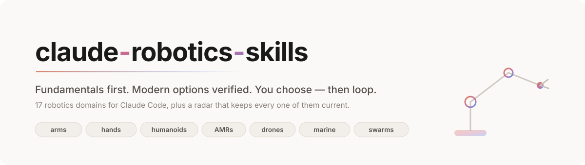
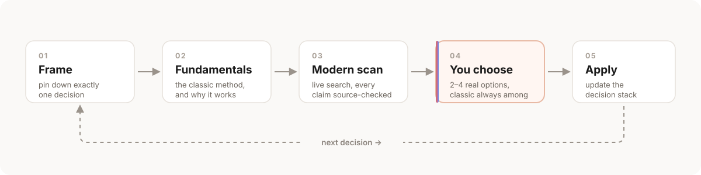
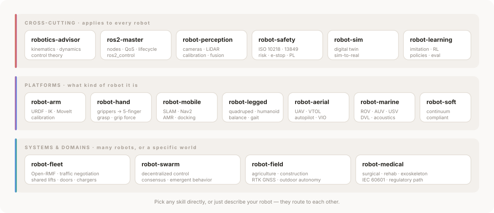

<div align="center">



[](LICENSE)
[](https://github.com/joey114132/claude-robotics-skills)
[](#the-skills)
[](#why-youd-trust-it)

**[Install](#install) · [The skills](#the-skills) · [How it works](#how-it-works) · [Why you'd trust it](#why-youd-trust-it)**

</div>

---

## The problem

Ask any AI assistant *"which IK solver should I use?"* and you get a confident paragraph. It names a library that was archived two years ago, quotes a spec it half-remembers, and skips the textbook method that would have been the right answer for your 6-DOF arm.

Robotics punishes that. The field is old enough to have deep fundamentals and fast enough that half the tooling you remember is stale.

**These skills fix both ends.** Every answer starts from the classic method and *why* it works, then adds modern alternatives that were verified against live sources in that same conversation. Then it stops and lets you choose.

<div align="center">

</div>

---

## The skills

<div align="center">

</div>

You never need to remember which one to call. Describe your robot and the right skill triggers itself, then hands off to its neighbors as the problem moves.

<details>
<summary><b>Cross-cutting</b> — applies to every robot</summary>

| Skill | What it decides with you |
|-------|--------------------------|
| [`robotics-advisor`](skills/robotics-advisor/SKILL.md) | The method itself: kinematics, dynamics, control theory. Grounds the choice in fundamentals before any library gets named. |
| [`ros2-master`](skills/ros2-master/SKILL.md) | Architecture: topic vs service vs action, lifecycle nodes, QoS, executors, ros2_control. |
| [`robot-perception`](skills/robot-perception/SKILL.md) | Sensing: camera/LiDAR/depth choice, intrinsic and hand-eye calibration, 3D perception, sensor fusion, time sync. |
| [`robot-safety`](skills/robot-safety/SKILL.md) | Keeping people intact: risk assessment, ISO 10218 / TS 15066 limits, performance levels, e-stop architecture, certification path. |
| [`robot-sim`](skills/robot-sim/SKILL.md) | Simulation strategy: which simulator, contact fidelity, domain randomization, and whether sim results actually predict hardware. |
| [`robot-learning`](skills/robot-learning/SKILL.md) | Whether to learn at all — then demonstrations, policy class, evaluation protocol, and a safety wrapper the policy can't override. |

</details>

<details>
<summary><b>Platforms</b> — what kind of robot it is</summary>

| Skill | What it decides with you |
|-------|--------------------------|
| [`robot-arm`](skills/robot-arm/SKILL.md) | URDF → IK → hardware interface → MoveIt 2 → calibration → safety, in dependency order. |
| [`robot-hand`](skills/robot-hand/SKILL.md) | Parallel-jaw through 5-finger anthropomorphic: grasp strategy, grip force control, in-hand manipulation, teleop retargeting. |
| [`robot-mobile`](skills/robot-mobile/SKILL.md) | SLAM vs prebuilt maps, localization, Nav2 planners and costmaps, docking, multi-floor. |
| [`robot-legged`](skills/robot-legged/SKILL.md) | Quadrupeds and humanoids: balance criteria, gait and footstep planning, locomotion MPC vs RL, loco-manipulation. |
| [`robot-aerial`](skills/robot-aerial/SKILL.md) | Multirotor vs VTOL, autopilot stack, GPS-denied flight, payload and endurance budget, failsafes. |
| [`robot-marine`](skills/robot-marine/SKILL.md) | ROV vs AUV vs USV, thruster allocation, underwater localization without GPS, pressure and corrosion. |
| [`robot-soft`](skills/robot-soft/SKILL.md) | Soft and continuum robots: actuation, modeling limits, soft sensing, and when compliance genuinely beats rigid. |

</details>

<details>
<summary><b>Systems &amp; domains</b> — many robots, or a specific world</summary>

| Skill | What it decides with you |
|-------|--------------------------|
| [`robot-fleet`](skills/robot-fleet/SKILL.md) | Open-RMF, traffic negotiation, shared lifts and doors and chargers, task dispatch, DDS discovery at scale. |
| [`robot-swarm`](skills/robot-swarm/SKILL.md) | Decentralized control, consensus, emergent behavior — and the honest question of when a swarm beats a coordinator. |
| [`robot-field`](skills/robot-field/SKILL.md) | Outdoor autonomy: agriculture, construction, inspection, RTK GNSS and its failure modes, environmental hardening. |
| [`robot-medical`](skills/robot-medical/SKILL.md) | Surgical, rehab, assistive: RCM mechanisms, physical human-robot interaction, and the regulatory path. |
| [`robotics-radar`](skills/robotics-radar/SKILL.md) | The collection's own maintenance sweep — see [Self-maintaining](#self-maintaining). |

</details>

---

## How it works

Each skill runs the same loop, one decision at a time.

**1 · Frame** — pin down exactly one decision, in dependency order. Broad requests get decomposed and started upstream, because downstream choices depend on the answer.

**2 · Fundamentals** — the classic method and *why it's shaped that way*. Terminology gets defined in plain language before the math.

**3 · Modern scan** — a live search, every invocation. Each skill ships a dated snapshot of its field, but treats it as a starting point to re-verify, never as an answer.

**4 · You choose** — 2–4 real options via a selection prompt, the classic method always among them, one marked as recommended with the reason stated.

**5 · Apply, then loop** — the choice goes on a running decision stack and the next decision surfaces. A choice that contradicts an earlier one stops the loop and says so, instead of silently overwriting it.

### Three ways to run it

| Mode | What happens |
|------|--------------|
| **Guided** *(default)* | One decision per turn with full reasoning. You're in the loop for each. |
| **Fast-forward** | It takes the recommended option at every gate and reports each choice in one line, stopping only where the decision is genuinely yours — irreversible, budget, or hardware-dependent. |
| **Audit** | No new decisions. It walks your existing setup against the sequence and reports what's unset, risky, or contradictory. |

Inside a `/loop`, Fast-forward is the default and the decision stack is reported each iteration.

---

## Why you'd trust it

**Nothing is presented that wasn't checked.** Every entry in every landscape snapshot carries a live source URL or an arXiv ID. A link checker ships with the repo:

```sh
python3 scripts/check_sources.py            # every skill, live URL check
python3 scripts/check_sources.py --offline  # format only, no network
```

Standard library only, non-zero exit on a dead link — drop it in CI.

**Findings that only exist because it verifies.** The snapshots record things a model answering from memory gets wrong: that `osrf/rmf_core` — the Open-RMF repo most training data still cites — was archived in 2021 and development moved to the `open-rmf` org. Archived-but-still-ranking repos are the exact failure this collection is built to prevent.

**It was measured, not just written.** Skill-guided runs were compared against the same model without the skills on realistic prompts:

| | With skills | Baseline |
|---|---|---|
| Assertion pass rate | **100%** (17/17) | 83.8% (14/17) |

The clearest gap: asked which IK method to use, the baseline never cited a source and jumped straight into unrequested implementation. The skill cited the textbook section, verified the libraries, and stopped for the user to choose. Full method and limitations in [EVAL.md](EVAL.md).

---

## Self-maintaining

Robotics snapshots rot. Two mechanisms keep these from going stale:

**Per-invocation.** Every skill re-verifies live before answering and rewrites its own snapshot in place when reality has moved past it. Using the skill maintains it.

**Periodic sweeps.** [`robotics-radar`](skills/robotics-radar/SKILL.md) orchestrates parallel research agents across stale domains, then a second adversarial pass that tries to *disprove* each finding and deletes what it can't confirm. It also hunts for coverage gaps — robot types and paradigms no skill covers yet — and adds new skills for the ones that turn out to be real and durable.

```
Update the robotics skills          # triage, sweep, verify, report the diff
Audit the robotics skills           # read-only staleness and dead-link report
```

Run it on a schedule and the collection keeps itself current without you.

---

## Install

```
/plugin marketplace add joey114132/claude-robotics-skills
/plugin install robotics-skills@claude-robotics-skills
```

That's it. Robotics topics trigger the right skill from the next session — you never type a skill name.

<details>
<summary>Manual install without the plugin system</summary>

```sh
git clone https://github.com/joey114132/claude-robotics-skills.git ~/claude-robotics-skills
mkdir -p ~/.claude/skills
for s in ~/claude-robotics-skills/skills/*/; do
  ln -sfn "${s%/}" ~/.claude/skills/"$(basename "$s")"
done
```

</details>

---

## Contributing

New skills follow the house structure: a decision sequence in dependency order, Loop modes, a Modern scan that re-verifies live, and a Gotchas section of real, expensive traps — not generic advice. Landscape entries need a live source. See [CLAUDE.md](CLAUDE.md) for the conventions and run `scripts/check_sources.py` before opening a PR.

## License

[MIT](LICENSE)
