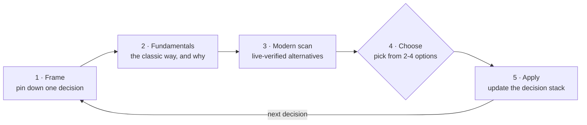

<div align="center">

# 🤖 claude-robotics-skills

**Fundamentals first. Modern options verified. You choose — then loop.**

Decision-making robotics skills for Claude Code.

[](LICENSE)
[](https://github.com/joey114132/claude-robotics-skills)
[](#-skills)

</div>

---

## ✨ Skills

| | Skill | What it does |
|---|-------|--------------|
| 🧠 | [`robotics-advisor`](skills/robotics-advisor/SKILL.md) | Grounds any robotics problem in **fundamentals** (kinematics · dynamics · control) first, then presents verified modern techniques side by side as options. |
| 🛰️ | [`ros2-master`](skills/ros2-master/SKILL.md) | ROS 2 architect — settles design decisions with you: topic/service/action, lifecycle nodes, QoS, executors, ros2_control. |
| 🦾 | [`robot-arm`](skills/robot-arm/SKILL.md) | Walks the manipulator integration pipeline stage by stage: URDF modeling → IK → hardware interface → MoveIt 2 → calibration → safety. |
| ✋ | [`robot-hand`](skills/robot-hand/SKILL.md) | End-effector decisions from parallel-jaw grippers to 5-finger anthropomorphic hands: grasp strategy (force/form closure), grip force control, in-hand manipulation, teleop retargeting. |
| 🛞 | [`robot-mobile`](skills/robot-mobile/SKILL.md) | Mobile base navigation — SLAM vs prebuilt maps, localization, Nav2 planners/costmaps, docking, multi-floor. |
| 🐕 | [`robot-legged`](skills/robot-legged/SKILL.md) | Quadrupeds and humanoids — balance criteria (ZMP · capture point · centroidal), gait and footstep planning, locomotion MPC vs RL policies, loco-manipulation, fall safety. |
| 🚦 | [`robot-fleet`](skills/robot-fleet/SKILL.md) | Multi-robot systems — Open-RMF, fleet management, traffic negotiation, shared resources (doors · lifts · chargers), task dispatch, DDS discovery at scale. |
| 🎓 | [`robot-learning`](skills/robot-learning/SKILL.md) | From teleop demonstration collection to imitation learning · RL · pretrained policy selection, evaluation protocols, and safety-wrapped deployment. |

## 🔁 How it works

Every skill follows the same **choose-and-loop**: one decision at a time — you pick, it moves to the next decision.



- The classic method is **always** one of the options — it's the baseline modern techniques improve on.
- Nothing unverified gets presented: every skill runs a **live search on every invocation**, starting from a dated snapshot (`references/landscape.md`) and refreshing it when the field has moved.
- A choice that contradicts an earlier one stops the loop and flags it — no silent overwrites.

## 📦 Install

Two commands inside Claude Code:

```
/plugin marketplace add joey114132/claude-robotics-skills
/plugin install robotics-skills@claude-robotics-skills
```

The skills trigger automatically on robotics topics from the next session.

<details>
<summary>Manual install without the plugin system (symlink)</summary>

```sh
git clone https://github.com/joey114132/claude-robotics-skills.git ~/claude-robotics-skills
mkdir -p ~/.claude/skills
for s in ~/claude-robotics-skills/skills/*/; do
  ln -sfn "${s%/}" ~/.claude/skills/"$(basename "$s")"
done
```

</details>

## 📊 Evaluation

Skill-vs-baseline comparison results live in [EVAL.md](EVAL.md) — iteration 1: **with-skill 100% vs baseline 83.8%** (+16.2pp).

## 📄 License

[MIT](LICENSE)
